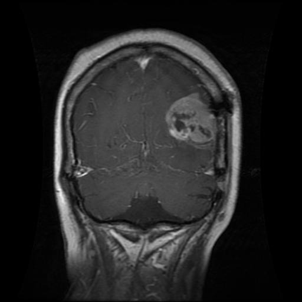

# Brain Tumor Classification Project

# Introduction

Brain tumors are abnormal growths within the brain. Tumors cause pressure build-up within the skull, often leading to severe complications and death. Cancerous or not, tumors interfere with critical neurological functions, necessitating timely detection.  

Earlier literature demonstrates that traditional image processing often struggles with categorizing brain tumors due to their wide variability. However, recent developments in deep learning have shown promise in improving accuracy in tumor classification.  

To amass data about tumors, we are using the publicly available [Brain Tumor MRI Dataset](https://www.kaggle.com/datasets/masoudnickparvar/brain-tumor-mri-dataset). This dataset contains over seven thousand Magnetic Resonance Imaging (MRI) scans of human brains. Each image is labeled by its respective tumor category or lack thereof.  

# Problem Definition

Diagnosing brain tumors from medical images is a complex process that is not always foolproof. Our project will give a second opinion for radiologists to ensure that they have made little to no oversights in their diagnosis of the patient into four distinct categories: Glioma, meningioma (non-cancerous), pituitary, and no tumor (healthy). Additionally, classifying the tumor by grade will aid in streamlining patients’ treatment. 

Diagnosing tumors is further complicated by variability in MRI acquisition and tumor appearance, which can lead to inconsistent readings across clinicians. Our system aims to provide a consistent, reproducible second opinion across the four classes, as well as offer a preliminary tumor-grade suggestion to help triage cases and streamline follow-up imaging and treatment planning. 

# Methodology

To classify brain tumors from MRI scans, our team’s approach combines robust preprocessing, supervised deeper learning models, and transfer learning to maximize accuracy and generalizability.  

### Data Processing

Data was prepared in two simple steps so that images were consistent and informative for model training:

**Automated cleaning script (OpenCV).** This utility script converts images to grayscale, slightly removes noise with Gaussian blur, removes small artifacts, defines brain region by contours, crops to that region, enhances contrast (histogram equalization + normalization), and resizes to 256×256. Cleaned copies of the images are then saved to organized class folders.

**Training-time transforms (PyTorch).** When loading data with `torchvision.datasets.ImageFolder`, we apply:
- Grayscale(num_output_channels=1)
- Resize((256, 256))
- ToTensor()
- Normalize(mean=0.5, std=0.5)

Images are then read from class labeled directories. The team used PyToch DataLoader with a `BATCH_SIZE = 32` and shuffling for the training set to expose the model to varied batches each epoch.

**Example training images (first: glioma, second: no tumor):**

\
*Figure 1. Example MRI slice labeled "glioma."*

\
*Figure 2. Example MRI slice labeled "no tumor."*

### Machine Learning Model
A lightweight Convolutional Neural Network (CNN) was implemented to learn special patterns within the MRI image dataset. The model is intentioanlly small so it trains quickly and runs on modest hardware while still capturing texture and shape cues for a variety of MRI image styles.

**Architecture (PyTorch):**
- Conv blocks (×3): Conv2d → ReLU → MaxPool(2×2) with channels 1→16→32→64, kernel 3×3 (padding 1).
- Flatten to a vector of size 64×32×32.
- Fully connected: Linear(64×32×32 → 128) → ReLU → Linear(128 → 4).
- The final layer outputs 4 logits (one per class).

**Training setup:**
- Loss: Cross-Entropy (standard for multi-class classification).
- Optimizer: Adam with learning rate 0.001.
- Batch size: 32, Epochs: 10.

To monitor learning, training and evaluation loss and accuracy are printed at each epoch. After training, learned weights are saved as brain_tumor_cnn.pth so the classifier can be reloaded for evaluation or for single image predictions without retraining.

This CNN was selected because it is easy to understand, fast to train, and well-suited for recognizing localized features such as edges, textures, and shapes which are common when distinguishing between tumor types.

### Supervised Learning

The task is framed as four-class supervised classification with labels glioma, meningioma, pituitary, and no tumor. Labeled images are fed in small batches, the CNN predicts class logits, and the model is updated by minimizing cross-entropy loss with Adam. Standard metrics like accuracy and precision/recall/F1 are reported and confusion matrices are visualized in *Results* to understand which tumor types are most often confused.

In parallel, two additional supervised transfer-learning models, fine-tuned *ResNet-50* and *EfficientNet-B0*, are being developed for comparison, while an **unsupervised k-Means clustering** approach is also being explored to group MRI features without labels as a potential addition for the final product.

# Results

We will evaluate the performance of our brain tumor classification models using multiple quantitative metrics. We will strive for a high accuracy in predictions while precision, recall, and F score will ensure that performance is balanced across all tumor categories. In addition, we will use the area under the ROC curve to measure separability between classes and confusion matrices to identify specific error patterns. 

Our target is to achieve at least 80% accuracy with consistent precision and recall across the four classes: glioma, meningioma, pituitary, and no tumor. Meeting these benchmarks will demonstrate the model’s robustness and reduce the risk of bias toward particular tumor types. Our broader goal is to create a lightweight model suitable for hospital environments that functions as a decision support tool for radiologists. Ethical considerations will remain central, ensuring that the model supports rather than replaces clinical judgment. 

We anticipate that transfer learning architectures such as ResNet will outperform baseline CNNs, as demonstrated in prior studies on medical imaging [3]. With proper preprocessing and training, our system should provide reliable second opinions, helping radiologists reduce diagnostic oversights and improving patient outcomes. 

# References

[1] K. He, X. Zhang, S. Ren, and J. Sun, “Deep Residual Learning for Image Recognition,” in Proc. CVPR, 2016. 

[2] G. Litjens, T. Kooi, B. E. Bejnordi, et al., “A Survey on Deep Learning in Medical Image Analysis,” Medical Image Analysis, vol. 42, pp. 60–88, 
2017.tworks,” Proc. IEEE ICIP, 2018, pp. 3129–3133. 

[3] A. Afshar, A. Mohammadi, and K. Plataniotis, “Brain tumor type classification via capsule networks,” IEEE ICIP, 2018, pp. 3129–3133.

# Contributions

| Name                  | Proposal Contribution                |
|-----------------------|--------------------------------------|
| **Colin Shaw**        | Github repo/pages and problem definition |
| **Eduardo Romero Serra** | Team Organization / Methods / Presentation and Video|
| **Vinayak Ramasubramanian** | Topic research & ideation / Results / Markdown formatting|
| **Xingjian Ren**      | Gantt Chart|
| **Matthew Sampt**     | Introduction / Markdown Formatting|

# [Gantt Chart](https://docs.google.com/spreadsheets/d/1DeXpFdrviHhOgzM-KoJsPBr04g7CaRDW/edit?usp=sharing&ouid=112407754076113639711&rtpof=true&sd=true)

