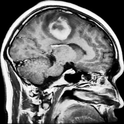
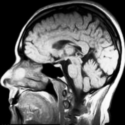

# Brain Tumor Classification Project

# Introduction

Brain tumors are abnormal growths within the brain. Tumors cause pressure build-up within the skull, often leading to severe complications and death. Cancerous or not, tumors interfere with critical neurological functions, necessitating timely detection.  

Earlier literature demonstrates that traditional image processing often struggles with categorizing brain tumors due to their wide variability. However, recent developments in deep learning have shown promise in improving accuracy in tumor classification.  

To amass data about tumors, we are using the publicly available [Brain Tumor MRI Dataset](https://www.kaggle.com/datasets/masoudnickparvar/brain-tumor-mri-dataset). This dataset contains over seven thousand Magnetic Resonance Imaging (MRI) scans of human brains. Each image is labeled by its respective tumor category or lack thereof.  

# Problem Definition

Diagnosing brain tumors from medical images is a complex process that is not always foolproof. Our project will give a second opinion for radiologists to ensure that they have made little to no oversights in their diagnosis of the patient into four distinct categories: Glioma, meningioma (non-cancerous), pituitary, and no tumor (healthy). Additionally, classifying the tumor by grade will aid in streamlining patients’ treatment. 

Diagnosing tumors is further complicated by variability in MRI acquisition and tumor appearance, which can lead to inconsistent readings across clinicians. Our system aims to provide a consistent, reproducible second opinion across the four classes, as well as offer a preliminary tumor-grade suggestion to help triage cases and streamline follow-up imaging and treatment planning. 

# Methodology

To classify brain tumors from MRI scans, our team’s approach combines robust preprocessing, supervised deep learning models, and transfer learning to maximize accuracy and generalizability.  

### Data Processing

Data was prepared in two simple steps so that images were consistent and informative for model training:

**Automated cleaning script (OpenCV):** This utility script converts images to grayscale, slightly removes noise with Gaussian blur, removes small artifacts, defines brain region by contours, crops to that region, enhances contrast (histogram equalization + normalization), and resizes to `256×256`. Cleaned copies of the images are then saved to organized class folders.

**Training-time transforms (PyTorch):** When loading data with `torchvision.datasets.ImageFolder`, we apply
- `Grayscale(num_output_channels=1)`
- `Resize((256, 256))`
- `ToTensor()`
- `Normalize(mean=0.5, std=0.5)`

Images are then read from class labeled directories. The team used PyTorch DataLoader with a `BATCH_SIZE = 32` and shuffling for the training set to expose the model to varied batches each epoch.

**Example training images (first: glioma, second: no tumor):**

\
*Figure 1. Example MRI slice labeled "glioma."*

\
*Figure 2. Example MRI slice labeled "no tumor."*

### Machine Learning Model
A lightweight Convolutional Neural Network (CNN) was implemented to learn special patterns within the MRI image dataset. The model is intentionally small so it trains quickly and runs on modest hardware while still capturing texture and shape cues for a variety of MRI image styles.

**Architecture (PyTorch):**
- Conv blocks (×3): `Conv2d → ReLU → MaxPool(2×2)` with channels `1→16→32→64`, kernel 3×3 (padding 1).
- Flatten to a vector of size `64×32×32`.
- Fully connected: `Linear(64×32×32 → 128) → ReLU → Linear(128 → 4)`.
- The final layer outputs 4 logits (one per class).

**Training setup:**
- Loss: Cross-Entropy, which is standard for multi-class classification.
- Optimizer: Adam with a learning rate of 0.001.
- Batch size: 32
- Epochs: 10

To monitor learning, training and evaluation loss and accuracy are printed at each epoch. After training, learned weights are saved as `brain_tumor_cnn.pth` so the classifier can be reloaded for evaluation or for single image predictions without retraining.

This CNN was selected because it is easy to understand, fast to train, and well suited for recognizing localized features such as edges, textures, and shapes which are common when distinguishing between tumor types.

### Supervised Learning

The task is framed as four-class supervised classification with labels glioma, meningioma, pituitary, and no tumor. Labeled images are fed in small batches, the CNN predicts class logits, and the model is updated by minimizing cross-entropy loss with `Adam`. Standard metrics like accuracy, precision, recall, and F1 are reported and confusion matrices are visualized in *Results* to understand which tumor types are most often confused by the model.

In parallel, two additional supervised transfer-learning models, fine-tuned *ResNet-50* and *EfficientNet-B0*, are being developed for comparison, while an **unsupervised k-Means clustering** approach is also being explored to group MRI features without labels as a potential addition for the final product.

# Results

The implemented Convolutional Neural Network (CNN) achieves strong performance on the Brain Tumor MRI dataset. This section reports the model's overall accuracy, class-wise precision/recall/F1, confidence statistics, and confusion matrices to show where the model succeeds and where it tends to make mistakes.

**Overall performance:** The Accurracy and Preciision/Recall/F1/Support values gathered from running the CNN over a training set of 1,311 images can bee seen in Table 1.
- **Accuracy:** 96.34%
*Table 1: Overall performance (Testing set, 1,311 images)*
| Class | Precision | Recall | F1 | Support |
|------------|-------|-------|-------|------|
| **glioma** | 0.952 | 0.927 | 0.939 | 300 |
| **meningioma** | 0.928 | 0.922 | 0.925 | 306 |
| **no tumor** | 0.978 | 1.000 | 0.989 | 405 |
| **pituitary** | 0.990 | 0.993 | 0.992 | 300 |
| **Macro averages** | **0.962** | **0.960** | **0.961** | - |

**Confidence summary:** For both splits the average prediction confidence is high, with Training 0.9982 ± 0.0142 and Testing 0.9835 ± 0.0638. On the test set, correct predictions are more confident (0.9883 ± 0.0524) than incorrect ones (0.8552 ± 0.1486), which is consistent with a well-behaved classifier.

*Figure 3: Summary of accuracy, class-wise metrics, and confidence statistics.*

### Visualization Results

The confusion matrices in Figure 2 highlight class specific behavior, with **No tumor** and **pituitary** classes being classified almost perfectly. Most errors occur between **glioma** and **meningioma** classes, which are visually similar on some slices, which causes the model to occasionally confuse these two. This visualization reveals that altough the model is mostly accurrate, it has some trouble identifying differences in images that share multiple similarities.

*Figure 4: Confusion matrices for Training (left) and Testing (right).*

### Model Perfomance

Overall this model perfomed well and was consistent at identifying and differentiating brain tumor in the majority of cases. Why?
- **Consistent inputs:** Data processing was key to success, with grayscale conversion, normalization, and resizing to 256×256 providing uniform inputs for learning.
- **CNN inductive bias:** Convolutions captured local edges, textures, and shapes that distinguishd tumor types, which fit this task well.
- **Stable optimization:** Minimizing cross-entropy loss with the Adam optimizer provided smooth and efficient convergence.

### Next steps

- **Model extensions:** Add two supervised transfer-learning approaches, fine-tuned ResNet-50 and EfficientNet-B0, for comparison on the same splits. This will help aliviate some of the accurracy issues between **glioma** and **meningioma**.
- **Focused error analysis:** Further prioritize improvements on **glioma** ↔ **meningioma** separability such as targeted preprocessing or feature emphasis, and incorporate probability based evaluation plots to validate improvements.
  
# References

[1] K. He, X. Zhang, S. Ren, and J. Sun, “Deep Residual Learning for Image Recognition,” in Proc. CVPR, 2016. 

[2] G. Litjens, T. Kooi, B. E. Bejnordi, et al., “A Survey on Deep Learning in Medical Image Analysis,” Medical Image Analysis, vol. 42, pp. 60–88, 
2017.tworks,” Proc. IEEE ICIP, 2018, pp. 3129–3133. 

[3] A. Afshar, A. Mohammadi, and K. Plataniotis, “Brain tumor type classification via capsule networks,” IEEE ICIP, 2018, pp. 3129–3133.

# Contributions

| Name                  | Proposal Contribution                |
|-----------------------|--------------------------------------|
| **Colin Shaw**        | Data Processing and Preparation |
| **Eduardo Romero Serra** | Team Organization / Report Writting / Gantt Chart |
| **Vinayak Ramasubramanian** | Accurracy / Precision / Visualization |
| **Xingjian Ren**      | Accurracy / Precision / Visualization |
| **Matthew Sampt**     | PyTorch Model Training / Model Testing |

# [Gantt Chart](https://docs.google.com/spreadsheets/d/1DeXpFdrviHhOgzM-KoJsPBr04g7CaRDW/edit?usp=sharing&ouid=112407754076113639711&rtpof=true&sd=true)

