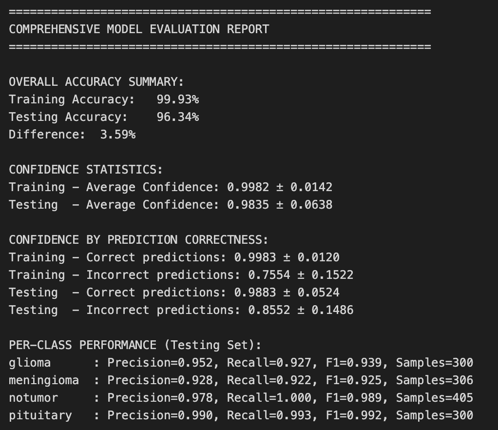
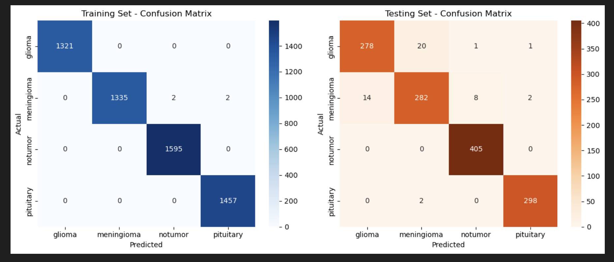
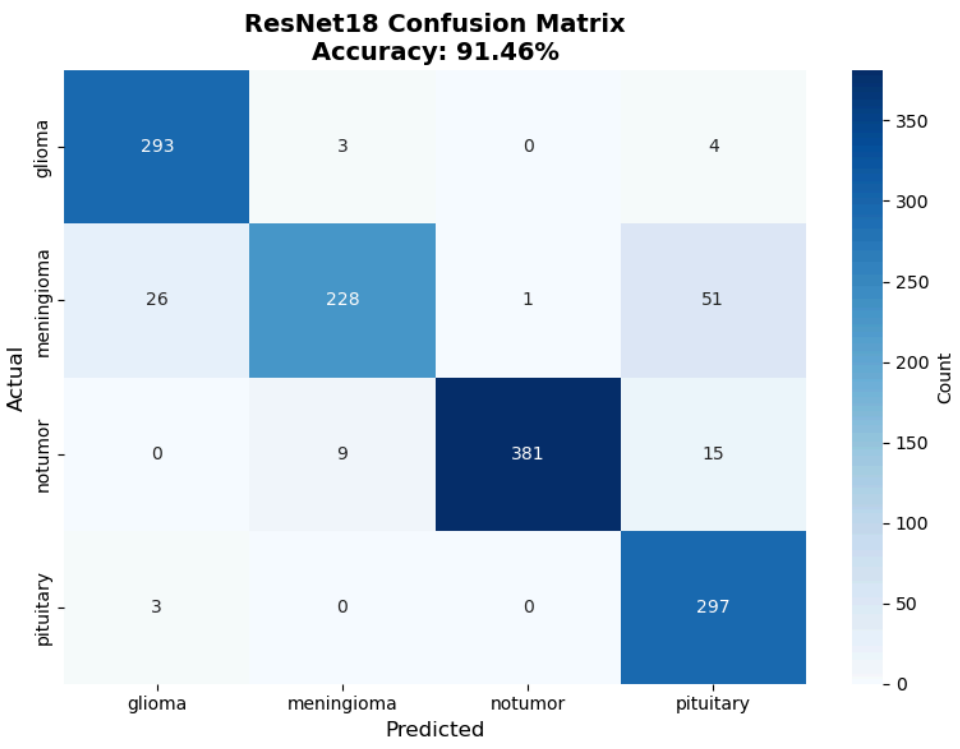
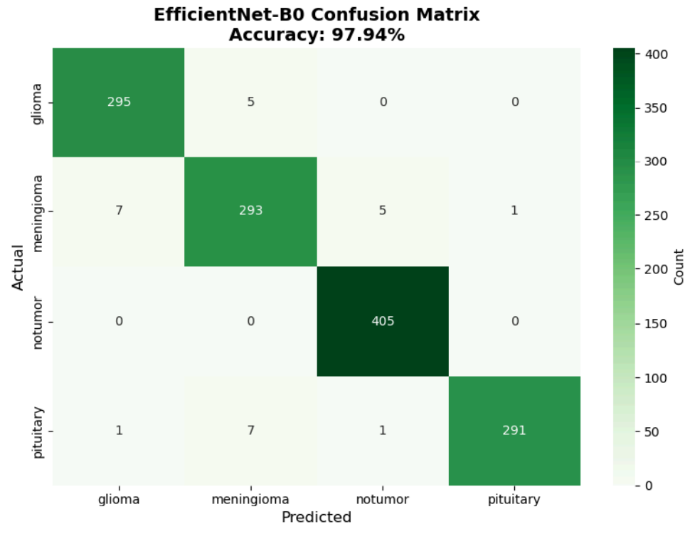
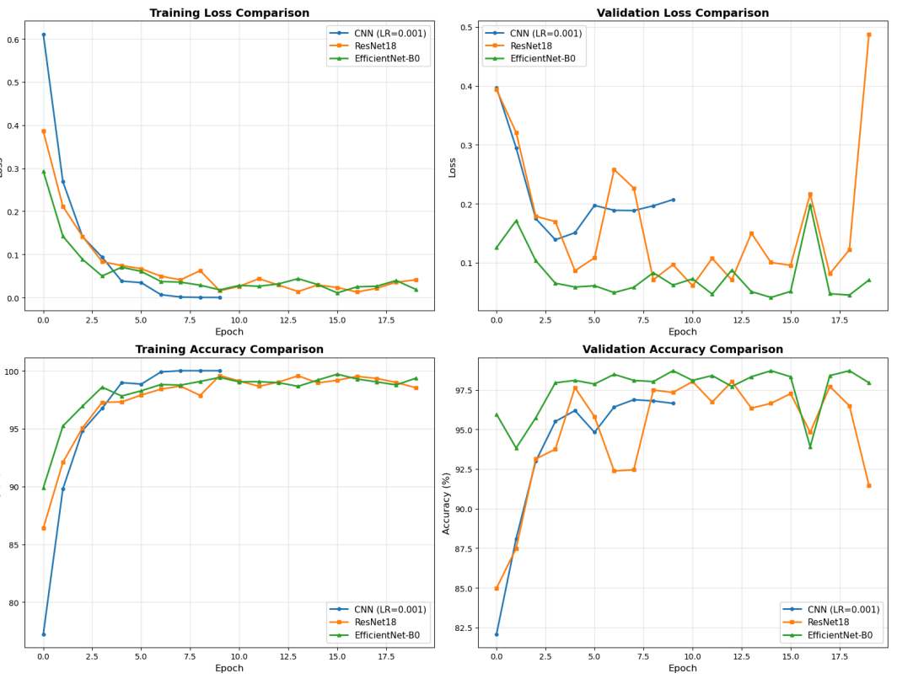
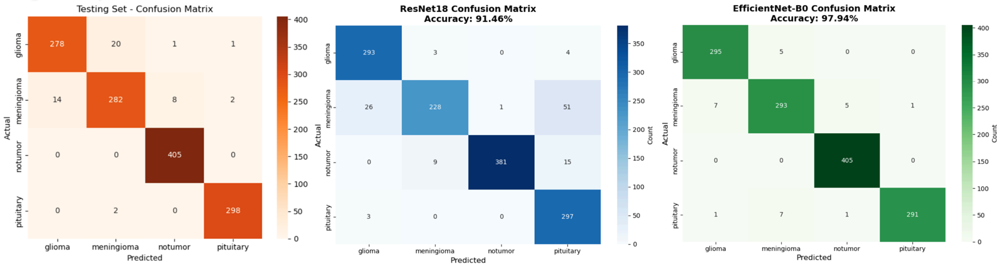
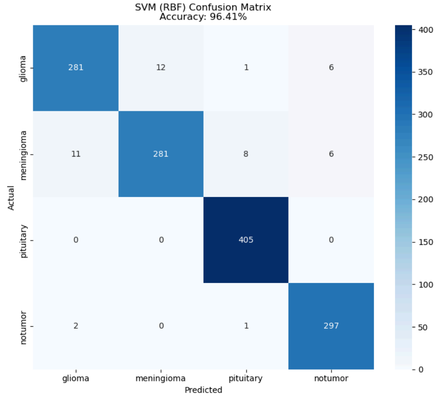

# Brain Tumor Classification Project

# Introduction

Brain tumors are abnormal growths within the brain. Tumors cause pressure build-up within the skull, often leading to severe complications and death. Cancerous or not, tumors interfere with critical neurological functions, necessitating timely detection.  

Earlier literature demonstrates that traditional image processing often struggles with categorizing brain tumors due to their wide variability. However, recent developments in deep learning have shown promise in improving accuracy in tumor classification.  

To amass data about tumors, we are using the publicly available [Brain Tumor MRI Dataset](https://www.kaggle.com/datasets/masoudnickparvar/brain-tumor-mri-dataset). This dataset contains over seven thousand Magnetic Resonance Imaging (MRI) scans of human brains. Each image is labeled by its respective tumor category or lack thereof.  

# Problem Definition

Diagnosing brain tumors from medical images is a complex process that is not always foolproof. Our project will give a second opinion for radiologists to ensure that they have made little to no oversights in their diagnosis of the patient into four distinct categories: Glioma, meningioma (non-cancerous), pituitary, and no tumor (healthy). Additionally, classifying the tumor by grade will aid in streamlining patients’ treatment. 

Diagnosing tumors is further complicated by variability in MRI acquisition and tumor appearance, which can lead to inconsistent readings across clinicians. Our system aims to provide a consistent, reproducible second opinion across the four classes, as well as offer a preliminary tumor-grade suggestion to help triage cases and streamline follow-up imaging and treatment planning. 

# Methodology

To classify brain tumors from MRI scans, our team’s approach combines robust preprocessing, supervised deep learning models, and transfer learning to maximize accuracy and generalizability.  

### Data Processing

Data was prepared in two simple steps so that images were consistent and informative for model training:

**Automated cleaning script (OpenCV):** This utility script converts images to grayscale, slightly removes noise with Gaussian blur, removes small artifacts, defines brain region by contours, crops to that region, enhances contrast (histogram equalization + normalization), and resizes to `256×256`. Cleaned copies of the images are then saved to organized class folders.

**Training-time transforms (PyTorch):** When loading data with `torchvision.datasets.ImageFolder`, we apply
- `Grayscale(num_output_channels=1)`
- `Resize((256, 256))`
- `ToTensor()`
- `Normalize(mean=0.5, std=0.5)`

Images are then read from class labeled directories. The team used PyTorch DataLoader with a `BATCH_SIZE = 32` and shuffling for the training set to expose the model to varied batches each epoch.

**Example training images (first: glioma, second: no tumor):**

\
*Figure 1. Example MRI slice labeled "glioma."*

\
*Figure 2. Example MRI slice labeled "no tumor."*

### Convolutional Machine Learning Models

Three supervised convolutional architectures were evaluated on the same preprocessed dataset and training/testing conditions:

1. **Model 1 – Baseline CNN trained from scratch**  
2. **Model 2 – ResNet18 (transfer learning)**  
3. **Model 3 – EfficientNet-B0 (transfer learning)**

All three models were optimized with cross-entropy loss and the Adam optimizer, and all use the same batch size (32) and image resolution (256×256). This guided more focus towards architectural differences rather than processing or optimization confounds.

#### Model 1 – Baseline Lightweight CNN

A lightweight Convolutional Neural Network (CNN) was implemented to learn special patterns within the MRI image dataset. The model is intentionally small so it trains quickly and runs on modest hardware while still capturing texture and shape cues for a variety of MRI image styles.

**Architecture (PyTorch):**
- Conv blocks (×3): `Conv2d → ReLU → MaxPool(2×2)` with channels `1→16→32→64`, kernel 3×3 (padding 1).
- Flatten to a vector of size `64×32×32`.
- Fully connected: `Linear(64×32×32 → 128) → ReLU → Linear(128 → 4)`.
- The final layer outputs 4 logits (one per class).

**Training setup:**
- Loss: Cross-Entropy, which is standard for multi-class classification.
- Optimizer: Adam with a learning rates of 0.001, 0.005, and 0.01.
- Epochs: 10 for LR = 0.001, 20 for LR = 0.005 & 0.01
- Batch size: 32

To monitor learning, training and evaluation loss and accuracy were printed at each epoch. After training, learned weights were saved as `brain_tumor_cnn.pth` so the classifier could be reloaded for evaluation or for single image predictions without retraining.

This CNN was selected as a baseine because it is easy to understand, fast to train, and well suited for recognizing localized features such as edges, textures, and shapes which are common when distinguishing between tumor types.

#### Model 2 – ResNet18 (transfer learning)

To test a deeper architecture with residual connections, a **ResNet18** model pre-trained on ImageNet was implemented. Residual blocks help gradients flow through deeper networks and can capture more complex features than our small CNN.   

**Key modifications and configuration:**
- **Input adaptation:** The original 3-channel first convolution was modified to accept a **1-channel** grayscale input.  
- **Output head:** The final fully connected layer was replaced with a new linear layer producing **4 class logits**.   
- **Initialization:** Initialized from ImageNet weights and fine-tuned the full network using the brain MRI dataset.
- **Training:**  
  - Loss: Cross-Entropy  
  - Optimizer: Adam with learning rate `0.001`  
  - Epochs: 20  
  - Same `batch_size = 32` and transforms as the baseline CNN   

ResNet18 was selected because it is a widely used residual network that is deeper than the baseline CNN but still lightweight, making it a good candidate for transfer learning on a medium-sized medical imaging dataset.

#### Model 3 – EfficientNet-B0 (transfer learning)

Finally, **EfficientNet-B0** with transfer learning wax implemented. EfficientNet architectures use compound scaling of depth, width, and resolution to provide strong performance with relatively few parameters. This makes EfficientNet-B0 a promising candidate for high accuracy under computational constraints. :contentReference[oaicite:16]{index=16}  

Model customization:

- **Base model:** `torchvision.models.efficientnet_b0(pretrained=True)`  
- **Input adaptation:** Modify the first convolution in the feature extractor to accept a single grayscale channel. :contentReference[oaicite:17]{index=17}  
- **Output head:** Replace the final classifier with a linear layer outputting 4 logits (one per class). :contentReference[oaicite:18]{index=18}  

Training configuration:

- Loss: Cross-Entropy  
- Optimizer: Adam with learning rate `0.001`  
- Epochs: 20  
- Same batch size and transforms as the other models  
- Model weights saved as `brain_tumor_efficientnet_b0.pth` for later evaluation   

EfficientNet-B0 was chosen to represent a **modern, parameter-efficient architecture** that often outperforms older backbones in image classification, especially when fine-tuned on domain-specific data like MRI.

### Classical Model Approach

#### Model 4 – Support Vector Machine (SVM) Classifier

To evaluate a traditional machine learning approach alongside the neural architectures, a **Support Vector Machine (SVM)** classifier was implemented using scikit-learn. Instead of raw MRI pixels, which are high dimensional and difficult for classical models to generalize on, we extracted compressed deep features from the **trained EfficientNet-B0 model** and used them as fixed input representations. This allows the SVM to take advantage of strong CNN-learned feature embeddings while reducing computational complexity and overfitting risk.

**Feature Extraction Workflow**
1. Loaded EfficientNet-B0 model with learned weights fixed.
2. Removed the classification head to output the penultimate feature vector.
3. Passed each MRI image once through EfficientNet-B0 to extract a **high-level feature embedding**.
4. Flattened embeddings and stored them with corresponding class labels for scikit-learn.

This approach transforms all training and testing images into a consistent numerical feature space suitable for classical ML algorithms.

**SVM Classifier Configuration**
- Library: scikit-learn SVC
- Kernel: **RBF**
- Regularization: C = 1.0
- Gamma: “scale”
- Output: One-vs-One decision strategy for multi-class tumor classification

**Why SVM?**
- Provides a **strong margin-based classifier** with proven success on medical imaging feature vectors
- Avoids full end-to-end retraining → **faster experimentation**
- Offers a **reference benchmark** against deep neural models
- Ability to perform well on **smaller or noise-sensitive** feature spaces

This SVM setup tests whether neural network feature extraction combined with a simpler classifier can rival or outperform full deep learning pipelines for brain MRI classification.

# Results

Four approaches were evaluated to conduct brain tumor classification using MRI:  
1) Baseline CNN
2) ResNet18
3) EfficientNet-B0
4) SVM with deep features.

A a dataset of **1,311 images** was used to report all metrics.

### Individual Model Analysis - Baseline CNN

#### Overall Performance

The Accurracy and Preciision/Recall/F1/Support values gathered from running the trained model over a testing set of 1,311 images can bee seen in Table 1. Of the 1,311 testing samples, only 48 showed errors when classifying, with a final **Accuracy:** 96.34%.

*Table 1: Overall performance (Testing set, 1,311 images)*
| Class            | Precision | Recall | F1    | Support |
|------------------|----------:|------:|------:|--------:|
| **glioma**       | 0.952     | 0.927 | 0.939 | 300     |
| **meningioma**   | 0.928     | 0.922 | 0.925 | 306     |
| **no tumor**     | 0.978     | 1.000 | 0.989 | 405     |
| **pituitary**    | 0.990     | 0.993 | 0.992 | 300     |
| **Macro averages** | **0.962** | **0.960** | **0.961** | – |

#### Confidence Summary

For both splits the average prediction confidence is high, with Training 0.9982 ± 0.0142 and Testing 0.9835 ± 0.0638. On the test set, correct predictions are more confident (0.9883 ± 0.0524) than incorrect ones (0.8552 ± 0.1486), which is consistent with a well-behaved classifier. These values can be seen in further detail on Figure 3 below.

*Figure 3: Summary of accuracy, class-wise metrics, and confidence statistics.*

#### Visualization Results

The confusion matrices in Figure 4 highlight class specific behavior, with **No tumor** and **pituitary** classes being classified almost perfectly. Most errors occur between **glioma** and **meningioma** classes, which are visually similar on some slices, which causes the model to occasionally confuse these two. This visualization reveals that altough the model is mostly accurrate, it has some trouble identifying differences in images that share multiple similarities.

*Figure 4: Confusion matrices for Training (left) and Testing (right) on Baseline CNN model.*

#### Model Perfomance

Overall this model perfomed well and was consistent at identifying and differentiating brain tumor in the majority of cases. Why?
- **Consistent inputs:** Data processing was key to success, with grayscale conversion, normalization, and resizing to 256×256 providing uniform inputs for learning.
- **CNN inductive bias:** Convolutions captured local edges, textures, and shapes that distinguishd tumor types, which fit this task well.
- **Stable optimization:** Minimizing cross-entropy loss with the Adam optimizer provided smooth and efficient convergence.

### Individual Model Analysis – ResNet18

#### Overall Performance

The ResNet18 model achieved a strong overall performance with a **testing accuracy of 91.46%**. Out of 1,311 test images, **1,199 were correctly classified** and **112 were misclassified**.  
Performance metrics for each tumor class are summarized in Table 2.

*Table 2: Overall performance on the testing set (1,311 images)*  
| Class            | Precision | Recall | F1    | Support |
|------------------|----------:|------:|------:|--------:|
| **glioma**       | 0.910     | 0.977 | 0.942 | 300     |
| **meningioma**   | 0.950     | 0.745 | 0.835 | 306     |
| **no tumor**     | 0.997     | 0.941 | 0.968 | 405     |
| **pituitary**    | 0.809     | 0.990 | 0.891 | 300     |
| **Macro Avg.**   | **0.917** | **0.913** | **0.909** | – |

In general, Glioma and no tumor classes achieve excellent balance between precision/recall, while meningioma remains the most challenging class to identify accurately.

#### Confidence Summary

Prediction confidence remained high across the board:
- **Correct predictions:** 0.9843 ± 0.05  
- **Incorrect predictions:** 0.8738 ± 0.13  
- ~11% confidence gap suggests confidence still trends upward even when wrong

This indicates solid certainty in model predictions, with room for calibration improvements.

#### Visualization Results

The confusion matrix in Figure 5 highlights where misclassifications occur:
- **Glioma** and **no tumor** → rarely confused, high diagonal dominance  
- **Pituitary** → high recall but lower precision due to false positives  
- **Meningioma** → lowest recall, commonly misclassified as glioma or pituitary  

*Figure 5: Confusion matrix of ResNet18 predictions on the test dataset.*

#### Model Performance

Overall this mode had a succesful performance with a high testing accurracy. Why?
- **Residual connections** improves deep feature learning  
- **Transfer learning** offers strong generalization starting point  
- **High confidence scoring** reinforces prediction reliability  

However, the model suffered a lot in confussions between glioma and meningioma. Why?
- **Overfitting risk:** There is a noticeable gap between training and testing accuracy 
- **Tumor similarity issues:** Visual overlap between MRIs causes recurring misclassifications  
- **Calibration needed:** The model tends to remain highly confident even when wrong  

Overall, ResNet18 demonstrates robust classification ability with high confidence, but struggles on tumors that share strong texture/shape similarities.

### Individual Model Analysis – EfficientNet-B0

#### Overall Performance  

The EfficientNet-B0 model achieved the best overall performance among the evaluated convolutional architectures, with a **testing accuracy of 97.94%** on the 1,311-image test set. In total, **1,284 samples were correctly classified**, and only **27 samples were misclassified**. The performance metrics for each class are summarized in Table 3.  

*Table 3: Overall performance of EfficientNet-B0 on the testing set (1,311 images).*  
| Class            | Precision | Recall | F1    | Support |
|------------------|----------:|-------:|------:|--------:|
| **glioma**       | 0.9736    | 0.9833 | 0.9784 | 300    |
| **meningioma**   | 0.9607    | 0.9575 | 0.9591 | 306    |
| **no tumor**     | 0.9854    | 1.0000 | 0.9926 | 405    |
| **pituitary**    | 0.9966    | 0.9700 | 0.9831 | 300    |
| **Macro avg.**   | **0.9791** | **0.9777** | **0.9783** | – |

Overall, all four classes show high and balanced precision, recall, and F1-scores, with macro-averaged F1 close to 0.98. Its important to note that:  
- **No tumor** samples achieve perfect recall (1.00) and very high precision.  
- **Glioma**, **meningioma**, and **pituitary** all maintain F1-scores above 0.95, indicating consistently strong performance across tumor types.  

#### Confidence Summary  

EfficientNet-B0 also produces very confident predictions on the test set. The confidence analysis reports:  
- **Correct predictions:** 0.9890 (98.90%)  
- **Incorrect predictions:** 0.8027 (80.27%)  

There is an 18% confidence gap which suggests that correct classifications are typically made with near-maximal confidence, which is desirable for a high-stakes classification task. However, misclassifications tend to be less confident, which could be useful if combined with thresholding or rejection rules.  

#### Visualization Results  

Figure 6 shows the confusion matrix for EfficientNet-B0 on the test set and illustrates how the model distributes its predictions across the four classes:  
- Most entries lie along the diagonal, confirming the strong quantitative performance seen in Table 3.  
- No tumor samples are almost never confused with tumor classes, reflecting their perfect recall.  
- The remaining misclassifications are very rate and typically happen between tumor categories with overlapping visual characteristics such as glioma and meningioma.  

*Figure 6: Confusion matrix of EfficientNEt-B0 predictions on the test dataset.*

#### Model Performance  

EfficientNet-B0’s strong performance on this MRI classification task can be attributed to its compoound scaling strategy, which allows the model to extract detailed spatial features while remaining relatively parameter efficient. This model also relies on pretraining on a large dataset followed by fine tuning done on our specific dataset, which provides rich generic visual features that adapt well to medical imaging. Overall, EfficientNet-B0 behaves as a **high-accuracy, high-confidence classifier**, with minimal performance degradation across classes and a confusion matrix that closely matches the ideal diagonal structure.

### Convolutional Model Results Comparison

This section compares the performance for the three convolutional architectures analyzed above:

#### Quantitative Performance

Table 4 summarizes the main quantitative metrics for each convolutional model on the 1,311-image testing set.

*Table 4: Summary of convolutional model performance on the testing set (1,311 images).*
| Model           | Test Accuracy | Macro Precision | Macro Recall | Macro F1 | Avg. Conf. (Correct) | Avg. Conf. (Incorrect) |
|-----------------|--------------:|----------------:|-------------:|---------:|----------------------:|------------------------:|
| **Baseline CNN**| 0.9634        | 0.962           | 0.960        | 0.961    | 0.9883               | 0.8552                 |
| **ResNet18**    | 0.9146        | 0.917           | 0.913        | 0.909    | 0.9843               | 0.8738                 |
| **EfficientNet-B0** | 0.9794    | 0.9791          | 0.9777       | 0.9783   | 0.9890               | 0.8027                 |

- **EfficientNet-B0** achieves the **highest overall accuracy** and **best macro-averaged metrics**, only misclassifying 27 samples.
- The **Baseline CNN** also performs very well, with accuracy above 96% and balanced precision/recall across all classes.
- **ResNet18** trails behind both, with lower macro F1 and noticeably more misclassifications, especially for the meningioma class.

Figure 7 below illustrates the training and validation behavior across the three convolutional models. All models show smooth declines in training loss and steady increases in training accuracy, indicating effective learning. EfficientNet-B0 consistently reaches the lowest validation loss and highest validation accuracy throughout training, reflecting its strong generalization capabilities. The Baseline CNN also maintains stable validation performance with minimal overfitting, while ResNet18 exhibits more variability in validation loss and accuracy, aligning with its comparatively lower test performance.

*Figure 7: Training and validation loss/accuracy comparison across the three convolutional architectures.*

#### Error Patterns and Confusion Matrices

Across all three models, the confusion matrices show similar qualitative patterns:

- **“No tumor”** and **“pituitary”** are the most reliably classified classes:
  - Baseline CNN and EfficientNet-B0 achieve almost perfect performance for these categories.
  - ResNet18 maintains strong performance here, but with slightly more errors.
- **“Glioma” vs. “meningioma”** remains the main source of confusion:
  - Baseline CNN and ResNet18 frequently misclassify between these two tumor types.
  - EfficientNet-B0 still shows some confusion between them, but at a much lower rate, as reflected by its higher F1 scores.

These patterns confirm that the main difficulty is not in detecting the presence of a tumor vs. no tumor, but in distinguishing between specific tumor subtypes that can appear visually similar in certain slices.

*Figure 8: Side by side comparison of confusion matrices for all three convolutional models.*

In summary, the convolutional model comparison clearly shows that while all three architectures are effective for brain tumor MRI classification, **EfficientNet-B0** provides the most accurate and reliable predictions, with the Baseline CNN serving as a strong, simpler alternative and ResNet18 offering competitive performance but with more pronounced weaknesses on certain tumor classes.

### SVM Model Analysis

#### Overall Performance  

The Support Vector Machine (SVM) models were trained on flattened `256×256 grayscale images`, reduced with PCA to 100 components before classification. The main configuration used an RBF kernel with C = 10 and gamma = "scale". This RBF-kernel SVM achieved an **overall test accuracy of 96.41%**, correctly classifying **1,264 out of 1,311** test images.   

The final perfomance for each class for the RBF SVM is summarized in Table 5 below. 

*Table 5: Overall performance of the RBF SVM on the testing set (1,311 images).*
| Class         | Precision | Recall | F1    |
|---------------|----------:|------:|------:|
| **glioma**    | 95.6%     | 93.7% | 94.6% |
| **meningioma**| 95.9%     | 91.8% | 93.8% |
| **pituitary** | 97.6%     | 100.0% | 98.8% |
| **no tumor**  | 96.1%     | 99.0% | 97.5% |

These metrics show that the SVM performs very well across all four classes, with particularly strong results for **pituitary** and **no tumor**, and slightly lower recall on **meningioma** and **glioma**, similar to the convolutional models.

Polynomial-kernel SVMs were also tested, with:
- **Degree-3 polynomial SVM:** test accuracy 96.26%, with macro F1 ≈ 0.96 (very close to the RBF model).  
- **Degree-5 polynomial SVM:** test accuracy 93.21%, with macro F1 ≈ 0.93 and noticeably higher error rates, especially for glioma and meningioma.  

Overall, the **RBF SVM** and **degree-3 polynomial SVM** are the best-performing SVM variants, with the RBF model used as the main point of reference.

#### Confidence Summary  

The SVM's confidence analysis reveals a clear separation between correct and incorrect predictions:
- **Average confidence (correct predictions):** 0.9639 (96.39%)  
- **Average confidence (incorrect predictions):** 0.7109 (71.09%)  
- **Confidence gap:** ≈ 25 percentage points  

This is the largest confidence gap observed across all models, meaning that when the SVM is wrong, it is significantly less confident on that desition. In practice, this makes the SVM a good candidate for confidence based rejection rules, where low confidence predictions could be flagged for human review. This isnt a good fit four our end goal, however, which is serving as a second opinion model for doctors.

#### Visualization Results  

Figure 8 below shows the confusion matrix for the RBF SVM model. Analysis of this matrixs reveals results that mirror those given by the three convolutional models:
- Near-perfect performance on **pituitary** and **no tumor**, with almost all samples on the diagonal of the confusion matrix.  
- A small cluster of errors between **glioma** and **meningioma**, matching the main setbacks seen in the convolutional models.  
- Very few misclassifications overall (47 out of 1,311 samples), distributed mainly across the tumor subtypes rather than between tumor vs. no-tumor.

*Figure 9: Confusion matrix of SVM (RBF Version) predictions on the test dataset.*

These patterns suggest that even without learned convolutional filters, the SVM can separate most classes well once the high dimensional image data is compressed into a 100-dimensional PCA space.

Overall, the SVM serves as a strong classical baseline that nearly matches the best convolutional models on this dataset while providing especially interpretable confidence behavior.

### Final Takeways and Next Steps

#### Key Takeaways  

Across all models evaluated, the project yields several consistent findings:
- **High overall performance:** All main models achieve test accuracies **above 91%**, with the best-performing architectures (EfficientNet-B0 and the RBF SVM) reaching around **96–98% accuracy** on 1,311 test images.   
- **Robust detection of “no tumor” and pituitary:** Every model, including the SVM, classifies **no tumor** and **pituitary** cases with excellent recall and precision, indicating that the dataset provides strong distinguishing features for these classes.   
- **Persistent confusion between glioma and meningioma:** The main source of error across all approaches is confusion between **glioma** and **meningioma**, which share similar textures and shapes in the MRIs. This suggests that the limitation lies partly in the underlying data and class similarity, not just in the model choice.   

Taken together, these results show that modern CNNs and classical SVMs can both deliver reliable performance on this four class brain MRI task, with EfficientNet-B0 emerging as the strongest single model and the SVM providing a competitive, more traditional alternative.

#### Next Steps  

Future work could extend this project along several directions:
- **Cross-validation and external validation:** Use k-fold cross-validation and, if available, an external dataset from a different hospital to better estimate real world performance.  
- **Multi-sequence or 3D data:** Incorporate additional MRI sequences or 3D volumetric information to capture richer tumor structure which could help more clearly differntiate glioma and meningioma cases.  
- **Clinical integration:** Design an clear user interface where model predictions, confidence scores, and visual explanations are displayed together, supporting radiologists as a second opinion without replacing their judgment.

Overall, the results indicate that deep learning models, especially EfficientNet-B0, are well-suited for automated brain tumor classification, and that combining them with classical methods and uncertainty-aware strategies is a promising path toward safe, clinically useful decision support tools.

# References

[1] K. He, X. Zhang, S. Ren, and J. Sun, “Deep Residual Learning for Image Recognition,” in Proc. CVPR, 2016. 

[2] G. Litjens, T. Kooi, B. E. Bejnordi, et al., “A Survey on Deep Learning in Medical Image Analysis,” Medical Image Analysis, vol. 42, pp. 60–88, 
2017.tworks,” Proc. IEEE ICIP, 2018, pp. 3129–3133. 

[3] A. Afshar, A. Mohammadi, and K. Plataniotis, “Brain tumor type classification via capsule networks,” IEEE ICIP, 2018, pp. 3129–3133.

# Contributions

| Name                  | Proposal Contribution                |
|-----------------------|--------------------------------------|
| **Colin Shaw**        | Data Processing and Preparation |
| **Eduardo Romero Serra** | Team Organization / Report Writting / Gantt Chart / Presentation |
| **Vinayak Ramasubramanian** | ResNet18 Model / EfficientNet-B0 Model |
| **Xingjian Ren**      | SVM Model |
| **Matthew Sampt**     | Baseline CNN Model |

# [Gantt Chart](https://docs.google.com/spreadsheets/d/1DeXpFdrviHhOgzM-KoJsPBr04g7CaRDW/edit?usp=sharing&ouid=112407754076113639711&rtpof=true&sd=true)

